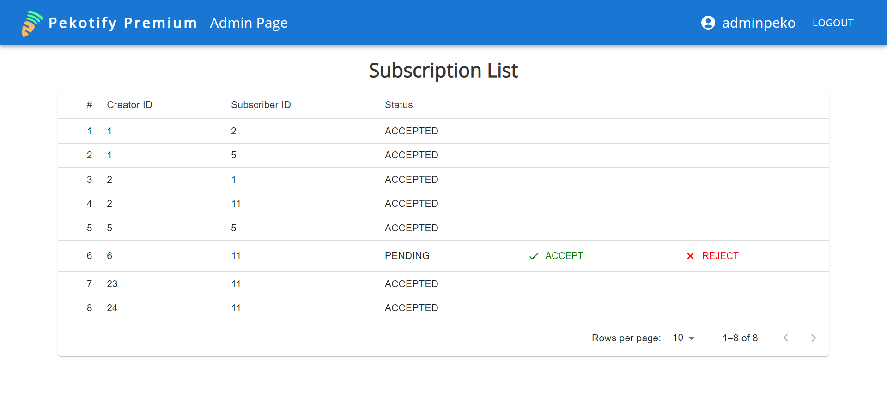
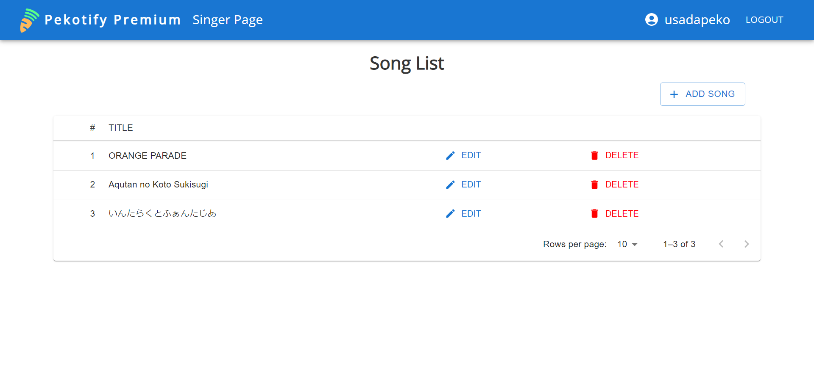

<!-- PROJECT LOGO -->
<br />
<div align="center">
    

  <h3 align="center">Pekotify Premium</h3>

  <p align="center">
    Pekotify management app for premium artists
  </p>
</div>


<!-- ABOUT THE PROJECT -->
## About The Project




Project ini dikerjakan untuk memenuhi Tugas Besar 2 IF3110 Pemrograman Berbasis Web


### Built By
- Rozan Fadhil Al Hafidz - 13520039
- Andreas Indra Kurniawan - 13520091
- Zayd Muhammad Kawakibi Zuhri - 13520144


### Built With

Project ini dibuat dengan


## Getting Started

Project ini dijalankan dengan menggunakan docker. 
### Prerequisites

- Docker Desktop

### Installation
1. Build docker image dengan command berikut
   ```sh
   docker build -t pekotify-premium-app:latest .
   ```
2. Jalankan command berikut untuk menjalankan docker container
   ```sh
   docker compose up
   ```
4. Buka Pekotify Premium dengan alamat http://localhost:3000/ di browser

Jika terjadi error, jalankan command `npm i` di dalam docker container


### Work Distribution
#### Server-side
- Login : 1352039, 13520144
- Register : 1352039, 13520144
- Song List (Singer Page) : 13520039
- Add Song : 13520039, 13520091, 13520144
- Edit Song : 13520039, 13520091, 13520144
- Admin Page : 13520039
